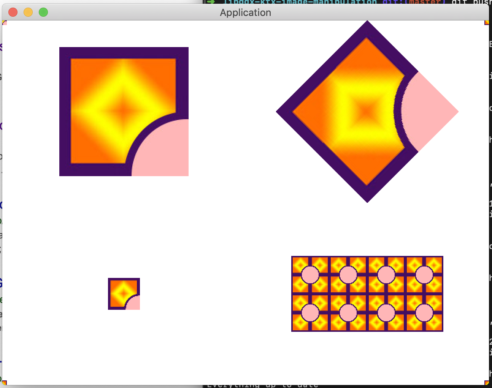

## Image manipulation 

LibGDX, game engine written in Java. KTX, Kotlin DSL for LibDGX. 

First tutorial in the LibGDX series, adapted for Kotlin.
https://libgdx.info/basic_image/

### About

If you are attempting to learn more about Kotlin and LibGDX this is a great first step. This tutorial aims to teach you about image manipulation and the coordinate system in LibGDX. 

### Uses 
* KtxScreen
* Texture
* JPEG
* Mirroring 
* Stage

### Screenshot

### How to Run

Clone or download a zip of the project

From the root of the project, execute: `./gradlew :desktop:run`